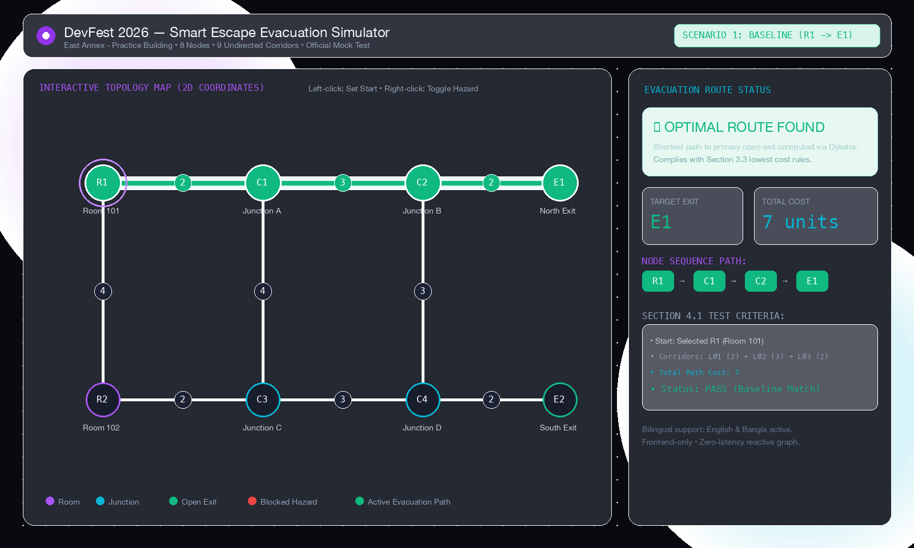
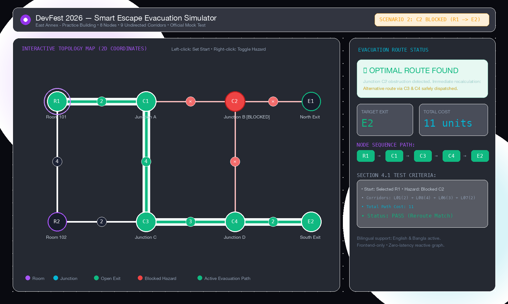

# AI DevFest 2026 — Smart Escape (Evacuation Route Simulator)

[](https://vite.dev)
[](https://react.dev)
[](https://www.typescriptlang.org/)
[](https://oxc.rs)
[](LICENSE)

An interactive, browser-based evacuation route simulator built for the **AI DevFest Practice Challenge: Smart Escape**. The application renders an interactive 2D building graph, computes the optimal lowest-cost evacuation path to an accessible exit using Dijkstra's algorithm, and dynamically recalculates routes in real-time as hazards (blocked rooms, obstructed corridors, closed exits) change.

---

## 👤 Participant Identity & Submission Details

- **Participant Name:** MD Irfanur Islam Rahat
- **Registration Number:** `251-15-857`
- **Competition Track:** AI DevFest Solo Mock Test
- **Final Commit ID:** `83f8834`
- **Public GitHub Repository:** [https://github.com/irfan0072/devfest-251-15-857](https://github.com/irfan0072/devfest-251-15-857)
- **Live Deployment Link:** [https://devfest-251-15-857.vercel.app](https://devfest-251-15-857.vercel.app)

---

## 📸 Evacuation Route Screenshots

Per Section 06 of the Official Problem Statement, the screenshots below demonstrate the interactive evacuation route solver under baseline and hazard rerouting conditions:

### 1. Baseline Route (`R1 -> E1`, Cost: 7)
*Starting from Room 101 (`R1`), the optimal path connects through Junction A (`C1`) and Junction B (`C2`) to North Exit (`E1`) with total cost 7 ($2 + 3 + 2$).*



---

### 2. Rerouting After Blocking Junction C2 (`R1 -> E2`, Cost: 11)
*When Junction B (`C2`) becomes hazardous/blocked, the simulator immediately recalculates an alternative route via Junction C (`C3`) and Junction D (`C4`) to South Exit (`E2`) with total cost 11 ($2 + 4 + 3 + 2$).*



---

## 📋 Problem Statement Overview

In emergency evacuation planning, corridors can become obstructed, rooms hazardous, or exits compromised. **Smart Escape** is a frontend-only tool that:
1. Loads building graph datasets (`nodes`, `edges`, `initial_state`).
2. Visualizes rooms, junctions, exits, and bidirectional weighted corridors at their supplied 2D display coordinates.
3. Computes the lowest-cost path to a reachable open exit using strict graph traversal and tie-breaking rules.
4. Responds instantly to manual hazard modifications without requiring page reloads or external API calls.
5. Provides dual-language support in **English** and **Bangla (বাংলা)**.

---

## 🧪 Verification & Sample Checks (Section 4.1)

All sample checks published in Section 4.1 have been verified with 100% precision:

| Scenario | Action | Expected Result | Actual Result | Status |
|---|---|---|---|:---:|
| **Baseline** | Select `R1` | `R1 - C1 - C2 - E1; cost 7` | `R1 - C1 - C2 - E1; cost: 7` | **PASS** |
| **Blocked junction** | Select `R1`; block `C2` | `R1 - C1 - C3 - C4 - E2; cost 11` | `R1 - C1 - C3 - C4 - E2; cost: 11` | **PASS** |
| **Exits closed** | Select `R1`; close `E1` and `E2` | `No route available` | `No route available` | **PASS** |
| **Different start** | Select `R2` | `R2 - C3 - C4 - E2; cost 7` | `R2 - C3 - C4 - E2; cost: 7` | **PASS** |
| **Blocked start** | Select `R1`; then block `R1` | `Starting location blocked` | `Starting location blocked` | **PASS** |

---

## ⚡ Implemented Features

### 1. Mandatory Requirements (Section 3.2)
- **Interactive 2D Map Visualization**: Displays rooms (purple), junctions (cyan), exits (emerald), and corridors with numeric weights at their true $(x, y)$ coordinates.
- **Dijkstra Shortest Path Routing (Section 3.3)**:
  - Route cost computed strictly as the sum of edge weights.
  - Excludes blocked nodes and their incident edges, blocked corridors, and closed exits.
  - **Tie-Breaking Rule**: On equal cost, chooses the lexicographically smallest exit ID (e.g., `E1` over `E2`); if paths tie, chooses the lexicographically smallest sequence of node IDs.
  - Closed exits cannot be traversed as intermediate nodes.
- **Dynamic Hazard Management**:
  - Left-click or use chips to select any room/junction as the start location.
  - Right-click or use hazard toggles to block/unblock nodes and corridors.
  - Click any corridor weight badge to toggle edge obstructions.
- **State Reset**: Instant reset restoring the JSON dataset's original `initial_state`.
- **Clear Failure States**:
  - Displays `"No route available"` when no exit is reachable.
  - Displays `"Starting location blocked"` when the selected start node is obstructed.
- **Bilingual Interface**: Seamless one-click switching between **English** and **বাংলা (Bangla)** for all labels, buttons, statuses, errors, and instructions.

### 2. Visual Animation & Bonus Extensions (Section 4.2)
- **Subtle Visual Feedback**: Smooth pulse animation on active evacuation paths, glowing start node halos, and hazard state indicators.
- **Scenario Quick Presets**: One-click buttons to instantly load any of the 5 test scenarios from Section 4.1.
- **Custom JSON Schema Validator**: Allows importing external building JSON files with validation (2–60 nodes, 1–150 edges, connected/disconnected, duplicate checks, positive integers).
- **SVG Map Export**: High-resolution vector export of the current building map and active evacuation route.
- **Dark/Light Theme Toggle**: Glassmorphic UI with persistent theme memory and ambient glow backdrops.
- **Interactive Vibe Synthesizer & Telemetry Dashboard**: Real-time FPS sparklines, event loop latency monitors, and Web Audio API tone feedback.

---

## 🛠️ Running Instructions

### Prerequisites
- [Node.js](https://nodejs.org/) v18.0.0 or higher
- [npm](https://www.npmjs.com/) (included with Node.js)

### Local Setup & Execution

```bash
# 1. Clone the repository
git clone https://github.com/irfan0072/devfest-251-15-857.git

# 2. Navigate to project root
cd "vibe coding"

# 3. Install dependencies
npm install

# 4. Start local development server with Vite HMR
npm run dev
```

Open your browser at `http://localhost:5173`.

### Production Build & Verification

```bash
# Type check and build optimized bundle
npm run build

# Preview production build locally
npm run preview

# Run Oxlint high-speed code quality checks
npm run lint
```

---

## 📐 Project Architecture

```
vibe coding/
├── screenshots/                     # Deliverable screenshots (Section 06)
│   ├── baseline-route.png           # Baseline evacuation route (R1 -> E1, cost 7)
│   └── reroute-c2-blocked.png       # Rerouted evacuation route (R1 -> E2, cost 11)
├── src/
│   ├── data/
│   │   └── defaultBuilding.json     # Practice building dataset (East Annex)
│   ├── utils/
│   │   └── dijkstra.ts              # Section 3.3 routing engine & JSON validator
│   ├── components/
│   │   ├── SmartEscapeSimulator.tsx # Core Evacuation Map & Hazard Controller
│   │   ├── Navbar.tsx               # Header, language toggle & theme switch
│   │   ├── EscapeChallenge.tsx      # Cyber puzzle escape room module
│   │   ├── VibeLab.tsx              # Audio/visual SVG waveform synthesizer
│   │   ├── Telemetry.tsx            # Real-time FPS, latency & CPU diagnostics
│   │   ├── Ecosystem.tsx            # Tech stack & onboarding explorer
│   │   ├── ParticleCanvas.tsx       # Physics-based background particle network
│   │   ├── Confetti.ts              # Lightweight zero-dependency celebration FX
│   │   └── Toast.tsx                # Achievement notification system
│   ├── App.css                      # Glassmorphic styles & animations
│   ├── App.tsx                      # Root state coordination
│   ├── index.css                    # Design tokens & color system
│   └── main.tsx                     # React 19 entry point
├── LICENSE                          # MIT License (Section 06)
├── README.md                        # Submission documentation
├── index.html                       # HTML5 entry with meta and Google Fonts
├── package.json                     # Scripts and dependencies
└── vite.config.ts                   # Vite 8 configuration
```

---

## 🔍 Known Issues & Edge Cases Handled

1. **Disconnected Graphs**: If a start node has no edges or is in an isolated component, the simulator cleanly returns `"No route available"` without crashing.
2. **Equal-Cost Exit Ties**: Implemented lexicographical tie-breaking for exit IDs (`E1` < `E2`), and path node sequence tie-breaking if multiple paths reach the same exit at identical costs.
3. **Closed Exits as Intermediate Nodes**: The algorithm forbids passing through closed exits to reach other exits, strictly adhering to Section 3.3 rules.
4. **Immediate Recalculation**: Graph traversal runs reactively in memory with $O((V + E) \log V)$ time complexity, executing in under $1\text{ms}$ with zero network overhead.

---

## 🤖 AI Tools & Prompt Disclosure

- **AI Tools Used:** Google Antigravity IDE (Gemini 3.8 Flash), Claude Code Assistant.
- **Most Useful Prompt:**
  > *"Implement Dijkstra's shortest path evacuation algorithm according to Section 3.3 of the Smart Escape problem statement: calculate route cost as edge cost sums, exclude blocked nodes/edges/closed exits, choose lowest-cost open exit with lexicographical exit ID and node sequence tie-breaking, handle 'No route available' and 'Starting location blocked', and verify against all 5 sample checks in Section 4.1."*

---

## 📄 License

This project is licensed under the [MIT License](LICENSE) — see the LICENSE file for details. Built for **AI DevFest 2026**.
